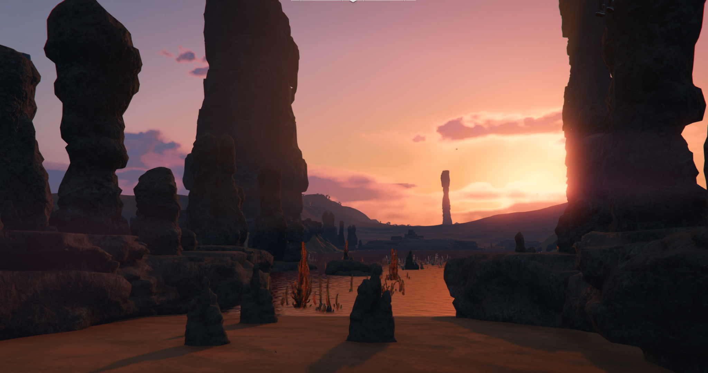
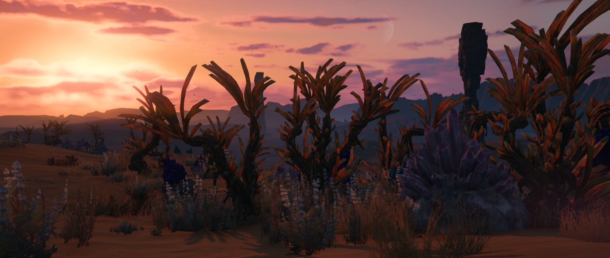
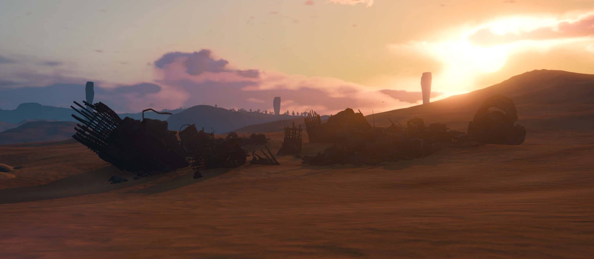
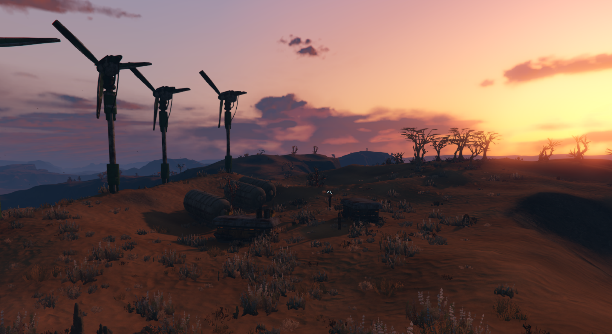

# Introduzione al Mondo

Il mondo in cui vivi non è mai stato gentile.  
Non lo è ora, e non lo è mai stato.

Il deserto domina ogni orizzonte: distese di sabbia battute dal vento, rocce affioranti come ossa scoperte, alture isolate che interrompono il paesaggio senza offrire riparo. Il cielo è vasto, spesso immobile, e il sole accompagna le giornate con una luce costante, pesante, che non concede tregua.

Qui, la vita non fiorisce. Resiste.

---

La vegetazione cresce in modo irregolare, adattandosi a un suolo che non perdona l’eccesso. Alberi dalle sagome contorte emergono dalla sabbia come se fossero stati piegati dal tempo stesso, mentre piante basse e secche si aggrappano a ciò che resta, silenziose e tenaci.

Il terreno non è mai davvero uniforme.  
La sabbia cambia consistenza, si spezza contro pietre levigate dal vento e lascia affiorare formazioni irregolari e cristalli di varia natura, presenti in molte zone del pianeta.

---

Anche gli animali si muovono con cautela.  
Creature rapide e guardinghe attraversano le pianure e le dune, spesso invisibili fino all’ultimo istante. Alcune evitano il contatto, altre difendono il proprio territorio con decisione.

---

Ovunque, il deserto conserva tracce di ciò che è venuto prima.  
Relitti metallici, strutture spezzate e resti di costruzioni emergono dalla sabbia, consumati dal tempo e dalle tempeste.

Accanto a essi sorgono, talvolta, accampamenti improvvisati: insediamenti temporanei, assemblati con materiali recuperati e destinati a durare solo finché il deserto lo permette.

---

Esistono però anche spazi che sembrano sottratti alla brutalità del pianeta.

Santuari antichi, tutti diversi tra loro, emergono dal deserto come strutture fuori dal tempo.  
Massicci, silenziosi, rispettati.

Questo è il mondo che conosci.  
Non ha bisogno di spiegazioni, perché ci vivi dentro.

